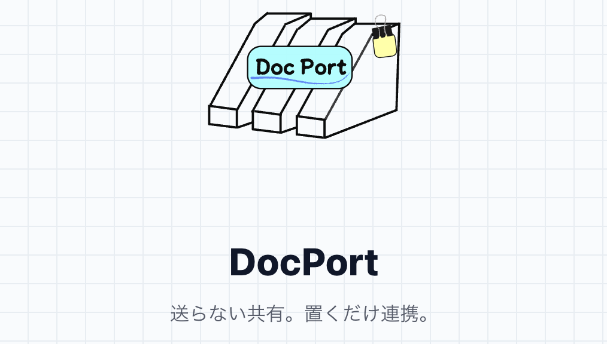

  

# DocPort

## 送らない共有。置くだけ連携。

DocPort は、病院間での FAX・電話・紙に依存した情報共有を置き換えるための  
**医療機関向けドキュメント共有アプリ**です。

> 「送る」のではなく、  
> 共通の場所に「置く」だけ。

通知・チャット・複雑な設定をあえて排除し、  
現場に合わせた最小構成で設計しています。

---

# 主な機能

## 🟦 置く（Send）

- PDFをドラッグ＆ドロップで配置
- 宛先病院を選択して「置く」だけ
- スキャン機能（台形補正・PDF化）
- 送信ではなく「状態として残す」設計

  

---

## 🟩 受け取る（Inbox）

- 自院宛ての資料を一覧表示
- 未読 / 既読 / 期限切れ / 取消 を可視化
- PDFはアプリ内プレビュー対応
- プレビュー時に既読状態へ更新

---

## 🟨 記録（Sent）

- 自院が置いた履歴を一覧表示
- 未読・期限内のみ取消可能
- ステータスで確認状況を把握
- プレビュー対応

  

---

# 🏗 技術構成

- **Frontend**：React / Vite / Cloudflare Pages
- **Backend**：FastAPI / Render
- **Auth / DB**：Supabase（Auth / PostgreSQL）
- **Storage**：Cloudflare R2（Presigned URL）
- **AI（予定）**：Gemini API
